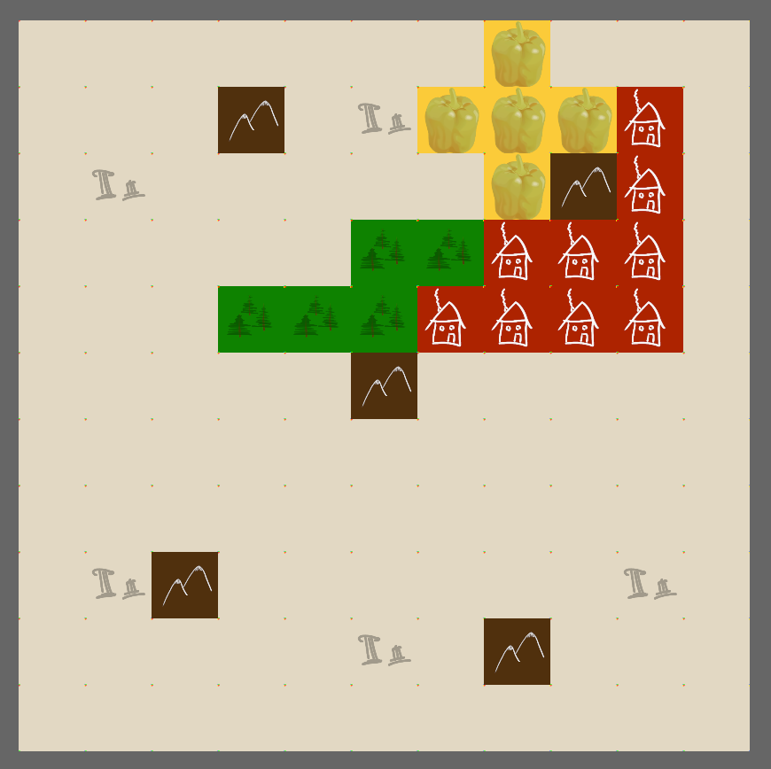

# Karthograph
## The Game
This is a small hobby project of mine. Those who know the board game "Karthograph" will probably recognise it, for the others: here is a short rule set:

You play with up to infinitely many players at the same time (if you got that many friends). Each player has a map that they have to fill with shapes. The shapes are determined by shape cards, which (usually) give the player a choice of two options. After each player has placed the shape on their map, the next card with the next shape is revealed. 

There are four seasons, each of which have certain (random) objectives to fulfil and a certain number of shape cards to be played. The objectives are known from the beginning, so each player should place their shapes with the objectives in mind.

The player with the most points (which he gets by fulfilling the objectives) wins in the end.

## The (implemented) Game
### Overview
This project is written in Rust and uses [Bevy](https://github.com/bevyengine/bevy) as engine, which uses the Entity Component System paradigm. For more information, please visit the [Bevy Website](https://bevyengine.org/).

### How to run
* Make sure you have Rust and Cargo installed ([see here](https://www.rust-lang.org/tools/install))
* Clone this repo
* run `cargo run` in the root folder of this repo

## Pictures
Here is a fancy screenshot of the map with some shapes drawn on it(wow):
